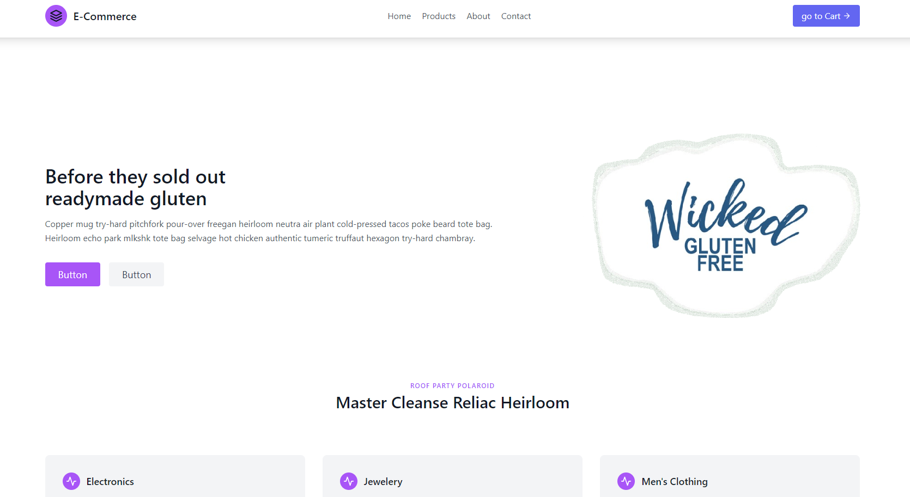

# Tailblocks - E-Commerce Website

Welcome to the **E-Commerce Website**! This is a fully responsive, modern e-commerce platform built using **React JSX**, **Tailwind CSS**, and **Tailblocks**. The website features a dynamic shopping cart, responsive design, and a clean user interface.

## React + Vite
This template provides a minimal setup to get React working in Vite with HMR and some ESLint rules.


## Features:

- **Responsive Design**: The website is fully responsive and works seamlessly on all devices (mobile, tablet, and desktop).
- **Dynamic Shopping Cart**: Add, remove, and update products in the cart with real-time calculations.
- **Product Listings**: Display products with details such as name, price, and quantity.
- **Tailwind CSS**: Utilizes Tailwind CSS for fast and customizable styling.
- **Tailblocks**: Pre-built Tailwind components from Tailblocks for a professional and consistent design.

## Technologies Used

- **React JSX**: A JavaScript library for building user interfaces.
- **Tailwind CSS**: A utility-first CSS framework for rapid UI development.
- **Tailblocks**: A collection of ready-to-use Tailwind CSS components.
- **React Icons**: For adding icons to the website.
- **React Router**: For handling navigation and routing.
- **Local Storage**: For persisting cart data in the browser.
- [@vitejs/plugin-react-swc](https://github.com/vitejs/vite-plugin-react-swc) uses [SWC](https://swc.rs/) for Fast Refresh

## Getting Started

Follow these steps to set up and run the project locally.

### Prerequisites

- Node.js and npm installed on your machine.

### Installation

1. **Clone the repository**:
   ```bash
   git clone https://github.com/codexpro410/ecommerce-tailblocks.git
   cd ecommerce-tailblocks
